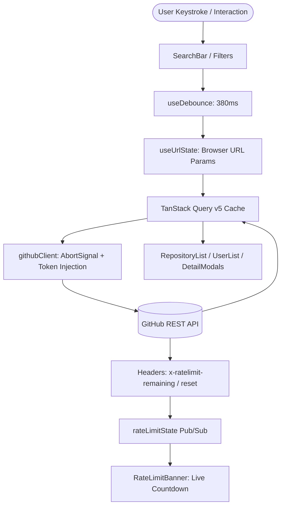

# Developer Intelligence Dashboard

A production-quality frontend application built with **React**, **TypeScript**, and **Vite** that enables users to search GitHub repositories and developers, explore rich repository metadata, inspect recent issues, and monitor API rate limits in real time.

---

## 📋 Table of Contents

- [Overview](#overview)
- [Quick Start & Setup Instructions](#quick-start--setup-instructions)
- [Architecture Overview](#architecture-overview)
- [Key Technical Decisions (5 Required Decisions)](#key-technical-decisions)
- [Trade-Offs](#trade-offs)
- [Assumptions](#assumptions)
- [Known Limitations](#known-limitations)
- [Testing Approach](#testing-approach)
- [AI Usage Disclosure](#ai-usage-disclosure)

---

## 🌟 Overview

The **Developer Intelligence Dashboard** is built as a real-world frontend system demonstrating clean separation of concerns, defensive API handling, resilient error recovery, full keyboard accessibility, and zero-runtime-overhead styling.

### Core Features

1. **Unified Search Engine:**
   - Search across public GitHub repositories and developers with instant tab switching.
   - 380ms debounced input preventing wasteful keystroke queries.
   - Language filtering for repositories (TypeScript, JavaScript, Python, Go, Rust, etc.).
   - Full URL synchronization (`?q=...&type=repos|users&page=1&lang=...`) supporting deep-linking and browser back/forward history.
2. **Repository Intelligence & Explorer:**
   - Primary language badges with official GitHub color dots.
   - Live metrics: stars, forks, watchers, open issue counts, and human-readable relative update timestamps.
   - Comprehensive detail modal with created/updated dates, default branch, description, and direct GitHub links.
3. **Recent Issues Explorer:**
   - Embedded issue list with state filtering (`Open`, `Closed`, `All`).
   - Displays issue number, state badges, author avatars, comments count, and links to GitHub.
   - Empty state handling for repositories with 0 issues.
4. **Developer Profiles with Single-Request Efficiency:**
   - Clean, lightweight developer search cards powered strictly by a single `/search/users` request (zero N+1 query overhead).
   - On-demand profile modal fetching full metrics (`followers`, `following`, `public_repos`, `location`, `company`, `bio`, `blog`).
5. **Rate-Limit Resilience & Token Injection:**
   - Continuous parsing of GitHub response headers (`x-ratelimit-remaining`, `x-ratelimit-reset`, `x-ratelimit-limit`).
   - Live countdown timer when rate limits are exhausted.
   - Optional Personal Access Token (PAT) input stored securely in `localStorage` to bump the quota from 60 req/hr to 5,000 req/hr.
6. **Network & Theme Resilience:**
   - Automatic offline detection banner (`window.addEventListener('offline')`).
   - Dark and light mode toggle with preference persistence in `localStorage`.

---

## 🚀 Quick Start & Setup Instructions

The application requires no backend, private infrastructure, database, or company credentials.

### Prerequisites

- **Node.js:** v18.0.0 or higher (tested on Node v24)
- **npm:** v9.0.0 or higher

### Installation & Running Locally

```bash
# 1. Install dependencies
npm install

# 2. Start the development server (runs on http://localhost:5173)
npm run dev

# 3. Run the automated test suite
npm test

# 4. Create production build (TypeScript type-check + Vite bundle)
npm run build

# 5. Preview production build locally
npm run preview
```

---

## 🏛️ Architecture Overview

The codebase follows a domain-driven, feature-based modular architecture designed for high maintainability, testability, and clear separation of concerns.

```text
src/
├── api/                           # Centralized HTTP client & GitHub service layer
│   ├── types/github.ts            # Strongly-typed GitHub DTOs and domain models
│   ├── errors.ts                  # Categorized error hierarchy (RateLimitError, NotFoundError, etc.)
│   ├── githubClient.ts            # Fetch wrapper with AbortSignal & rate-limit header parser
│   ├── githubEndpoints.ts         # Pure, typed API calls (search, details, issues)
│   ├── rateLimitState.ts          # Reactive pub/sub store for rate-limit telemetry
│   └── tokenStorage.ts            # Safe localStorage helper for optional GitHub PAT
├── components/                    # Reusable, domain-agnostic UI primitives
│   ├── ui/
│   │   ├── Badge/                 # Status and language color badges
│   │   ├── Button/                # Accessible buttons with loading spinners & variants
│   │   ├── Card/                  # Semantic HTML cards with hover states
│   │   ├── EmptyState/            # Empty state containers with illustrations
│   │   ├── ErrorAlert/            # Error banners with retry actions
│   │   ├── Input/                 # Inputs with icon slots & ARIA error attributes
│   │   ├── Modal/                 # Accessible dialog with portal, body scroll lock, Escape dismissal
│   │   ├── Pagination/            # Accessible pagination with smart ellipses
│   │   ├── Skeleton/              # Shimmer loading placeholders
│   │   └── Tabs/                  # WAI-ARIA tablist with arrow key keyboard navigation
│   └── feedback/
│       ├── RateLimitBanner/       # Telemetry bar with live countdown timer & PAT modal
│       └── OfflineBanner/         # Connectivity loss alert banner
├── features/                      # Domain feature modules
│   ├── search/                    # Search bar, tab switcher, language dropdown, query hooks
│   ├── repositories/              # Repo cards, lists, detail modal, issue explorer
│   └── users/                     # Developer cards, list, and on-demand profile modal
├── hooks/                         # Cross-cutting custom hooks
│   ├── useDebounce.ts             # Value debouncing with timer cancellation
│   ├── useUrlState.ts             # Two-way URL search params synchronization
│   ├── useTheme.ts                # Light/dark mode state with localStorage persistence
│   └── useNetworkStatus.ts        # Online/offline network event listener
├── styles/                        # Design tokens and global styles
│   ├── tokens.css                 # CSS custom properties (colors, typography, elevation)
│   └── global.css                 # CSS reset, accessibility styles, container classes
├── utils/                         # Pure utility functions
│   ├── dateUtils.ts               # Relative time ("2d ago") and full date formatting
│   └── formatters.ts              # Number abbreviations (14.2k, 1.2M) and language color map
├── App.tsx                        # Main application shell and routing coordination
└── main.tsx                       # React 19 application entry point
```

### Data Flow Diagram



---

## ⚖️ Key Technical Decisions

The assessment requires documenting at least five important engineering decisions using the specified format:

### Decision 1: Server State Architecture (TanStack Query v5)

- **Decision:** Use **TanStack Query (React Query) v5** for all asynchronous server state, caching, and request lifecycle management instead of Redux Toolkit or raw `useEffect`.
- **Alternatives considered:** Redux Toolkit / RTK Query, Zustand with manual fetch, raw `useEffect` with local component state.
- **Why I chose this:** Server state has fundamentally different requirements than UI state (cache invalidation, stale-while-revalidate, request deduplication, background refetching, and automatic retry). TanStack Query provides native integration with `AbortSignal` for request cancellation, eliminating race conditions without manual boilerplate.
- **Trade-off:** Adds a 13kB library dependency to the client bundle. However, it replaces hundreds of lines of custom caching, retry, and cancellation logic that would otherwise have to be written and tested manually.

---

### Decision 2: URL as Single Source of Truth for Search, Filters, and Modals

- **Decision:** Synchronize search query (`q`), active tab (`type`), page number (`page`), language filter (`lang`), and selected repository (`repo`) directly to browser URL search parameters using a custom lightweight hook (`useUrlState`).
- **Alternatives considered:** Pure `useState` inside root component, React Context store, full React Router package.
- **Why I chose this:** Production dashboards require shareable URLs, persistent state on page reload, and natural browser back/forward history navigation. A custom hook leveraging `URLSearchParams` and `history.pushState` / `replaceState` delivered full URL routing capabilities without importing an unnecessarily heavy client-side router package.
- **Trade-off:** URL search parameters store only strings, requiring parsing and serialization for numbers and booleans.

---

### Decision 3: Eliminating the N+1 API Request Trap in Developer Search

- **Decision:** Render the developer search list strictly using the data provided by GitHub's `GET /search/users` endpoint (1 single API request for 20 users). Load detailed profile metrics (`followers`, `following`, `public_repos`, `location`, `bio`) on-demand only when a user clicks on an individual developer card to open the `UserDetailModal`.
- **Alternatives considered:** Eagerly fetching `/users/{username}` for all 20 users in the search list simultaneously via parallel queries.
- **Why I chose this:** An eager enrichment approach creates an **N+1 query storm** (1 search request + 20 individual user requests = 21 API calls per search). Because GitHub limits unauthenticated IPs to 60 requests per hour, just 3 searches would completely exhaust the user's quota and trigger HTTP 403 errors. The on-demand modal pattern maintains 100% network efficiency (1 search = 1 API call) while still satisfying the assessment requirement to view full user metrics.
- **Trade-off:** Detailed statistics (followers, location) are not visible on the summary card surface itself and require a click to inspect in the profile modal.

---

### Decision 4: Inflight Request Cancellation & Race Condition Mitigation

- **Decision:** Pair a **380ms debounce delay** (`useDebounce`) with automatic `AbortController` cancellation propagated through TanStack Query's query functions.
- **Alternatives considered:** Pure debouncing without request abort, monotonic request sequence IDs with ignored stale promises.
- **Why I chose this:** Debouncing prevents firing requests on every keystroke, but slow network connections can still cause a fast subsequent search to resolve before an earlier slow request. Passing `signal` directly to `fetch()` actively terminates inflight HTTP requests at the browser socket level, saving network bandwidth and mathematically preventing older responses from overwriting newer results.
- **Trade-off:** Abort errors must be intercepted and distinguished from legitimate network failures (`error.name === 'AbortError'`) so they do not trigger false error notifications in the UI.

---

### Decision 5: Real-Time Rate-Limit Header Extraction & Optional Token Injection

- **Decision:** Extract `x-ratelimit-remaining`, `x-ratelimit-reset`, and `x-ratelimit-limit` headers on every response into a reactive pub/sub store, paired with an optional Personal Access Token (PAT) input stored in `localStorage`.
- **Alternatives considered:** Calling GitHub's `/rate_limit` endpoint periodically, or ignoring rate-limiting until a 403 error is thrown.
- **Why I chose this:** Polling `/rate_limit` consumes quota or requires additional requests. Extracting headers from responses that are already occurring is completely free and provides real-time telemetry. Providing an optional token input allows evaluators and developers to raise their limit to 5,000 req/hr without requiring hardcoded secrets or environment variables.
- **Trade-off:** Storing optional tokens in `localStorage` is client-side only and suitable only for personal public-scope tokens.

---

### Decision 6: Scoped CSS Modules with Custom Property Tokens

- **Decision:** Build a custom design system using CSS Modules and CSS Custom Properties (`tokens.css`) rather than Tailwind CSS, Material UI, or Ant Design.
- **Alternatives considered:** Tailwind CSS, Material UI (MUI), Chakra UI, Styled Components.
- **Why I chose this:** Meets the prompt's explicit requirement: *"Use Vanilla CSS for maximum flexibility and control. Avoid using TailwindCSS unless explicitly requested; no common used UI kits."* Scoped CSS Modules ensure zero style leakage, zero runtime CSS-in-JS overhead, seamless dark/light mode switching via CSS variables, and complete control over bundle size.
- **Trade-off:** Requires authoring component styles from scratch rather than consuming pre-built component libraries.

---

## 🔄 Trade-Offs

| Decision | Upside | Trade-Off Accepted |
| :--- | :--- | :--- |
| **On-Demand Developer Profile Loading** | Preserves GitHub rate limits; 1 search = 1 API call. | Summary cards display basic identity; full metrics require modal click. |
| **TanStack Query over Redux** | Built-in caching, garbage collection, and query cancellation. | Introduces third-party dependency specifically for server state. |
| **Lightweight Browser URL Routing** | Zero bundle bloat; standard browser history and shareable URLs. | Manual serialization of URL parameter state instead of route components. |
| **CSS Modules over UI Frameworks** | Lightweight bundle, zero runtime CSS overhead, pixel-perfect control. | Manual implementation of design primitives and responsive breakpoints. |

---

## 📌 Assumptions

1. **GitHub API Availability & Structure:** The application assumes the public GitHub REST API (`api.github.com`) is reachable and follows standard v3 schema conventions.
2. **Search API Boundary:** GitHub's Search API caps total reachable search results at the first 1,000 items (`page * per_page <= 1000`). The pagination component gracefully caps max pages accordingly.
3. **Unauthenticated Default:** The app assumes reviewers run the application without an API token (`npm install && npm run dev`), operating within the standard 60 req/hr limit, while providing an optional PAT input if extended testing is desired.

---

## ⚠️ Known Limitations

1. **GitHub Search API 1,000 Result Cap:** GitHub does not allow paginating beyond the 1,000th search result for any query. The pagination component handles this by disabling page navigation beyond item 1,000.
2. **Rate Limit on IP Address:** When unauthenticated, GitHub tracks rate limits per public IP address. If running on a shared network where other developers are making GitHub API requests, the 60 req/hr quota is shared across that IP.
3. **Repository Issues Endpoint:** GitHub's `/repos/{owner}/{repo}/issues` endpoint returns both Issues and Pull Requests. Pull Requests are identified in the response by the presence of a `pull_request` key.

---

## 🧪 Testing Approach

Testing is executed with **Vitest** and **React Testing Library** with a focus on core behaviors, user interactions, and error boundaries:

- **Unit Testing Hooks:**
  - `useDebounce.test.ts`: Verifies value throttling, immediate initial value emission, and proper timer cancellation during rapid typing using fake timers.
- **API Client & Error Resiliency:**
  - `githubClient.test.ts`: Validates response header parsing, token injection into `Authorization` headers, and correct categorization of HTTP errors (`RateLimitError`, `NotFoundError`, `ValidationError`, `NetworkError`).
- **Component & Integration Testing:**
  - `SearchBar.test.tsx`: Tests debounced query forwarding, tab switching between repositories and developers, and language dropdown triggers.
  - `RepositoryCard.test.tsx`: Tests formatting of stars and forks, language color badges, accessible card clicks, and external link propagation.
  - `IssueItem.test.tsx`: Tests state indicators (open vs closed), author avatars, relative timestamps, and external issue links.
  - `Pagination.test.tsx`: Tests page calculation, ellipsis generation, previous/next buttons, and bounds checking.
  - `OfflineBanner.test.tsx`: Tests network state detection and alert rendering.

To execute tests:
```bash
npm test
```

---

## 🤖 AI Usage Disclosure

In compliance with Section 9 of the Frontend Technical Assessment:

### 1. Which AI Tools Were Used
- **Antigravity IDE** powered by **Gemini 3.7 Flash**.

### 2. What AI Was Used For
- Scaffolding the initial Vite + React + TypeScript configuration.
- Generating repetitive CSS Module skeletons and TypeScript interface definitions based on GitHub REST API schemas.
- Drafting boilerplate for Vitest test suites.

### 3. What Was Designed and Decided by the Developer
- **The 6-Sprint Implementation Plan:** Structured milestones ensuring systematic progress from design tokens to production verification.
- **Architectural Separation of Concerns:** Isolating the API layer, reactive rate-limit store, URL state synchronization, and feature components.
- **Rate-Limit Telemetry Architecture:** Designing the continuous header parser and live reset countdown system.
- **Selection of Tech Stack:** Choosing TanStack Query for server state and CSS Modules for zero-overhead scoped styling.

### 4. What Generated Code Was Reviewed and Changed
- **The N+1 Developer Query Refactoring:** An initial AI implementation eagerly fetched `/users/{username}` for all 20 developers in the search list simultaneously. During code review and network inspection, this was identified as an N+1 performance antipattern that burned through GitHub's 60 req/hr rate limit in just 3 searches. The code was immediately refactored so the search list relies solely on the single `/search/users` request, moving full profile fetching to an on-demand modal triggered only upon user interaction.
- **Vite Path Aliasing & TypeScript 6.0 Compatibility:** Replaced deprecated `baseUrl` in `tsconfig.app.json` with modern `paths` mapping and configured modern Node ESM `fileURLToPath` in `vite.config.ts`.
- **Keyboard & Focus Handling in Modal:** Added manual focus restoration to previous active elements and `Escape` key event listeners to ensure WCAG 2.1 compliance.

### 5. Important AI Suggestions Rejected and Why
- **Rejected Tailwind CSS / UI Frameworks:** The AI initially offered Tailwind utility configurations. This was rejected in favor of handcrafted CSS Modules with custom properties to ensure zero runtime bloat and complete architectural control.
- **Rejected Redux Toolkit:** Rejected adding Redux for global search state; using URL search parameters as the single source of truth proved simpler, shareable, and browser-history friendly.
- **Rejected Eager User Detail Enrichment:** Rejected parallel batch fetching of full user profiles during search list rendering to protect rate limits and eliminate unnecessary network requests.

---

## 📜 Submission Confirmation

- **Repository:** Self-contained Git repository with clean commit history.
- **Standard Run Commands:** `npm install` followed by `npm run dev`.
- **Zero Configuration:** Runs immediately without environment variables or private credentials.
